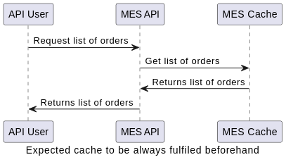
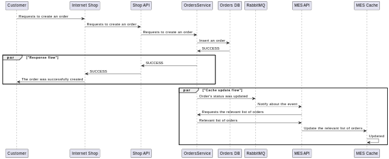

# Архитектурное решение по кешированию

## Мотивация

Для предоставления более качественного сервиса пользователям MES, а так же пользователям API необходимо добавить дополнительный уровень кэширования. Это позволит существенно сократить время одного запроса, а так же уменьшить нагрузку на базу данных.

## Предлагаемое решение

[Схема](./jewerly_c4_model_with_cache.drawio)

### Описание

Проблемы со скоростью чтения наблюдаются у двух пользователей: пользователей MES и пользователей MES API, оба типа запросов в итоге приходят на сервис MES API, следовательно именно его и следует кэшировать. Исходя из жалоб пользователей, наибольшие проблемы связаны с получением списка заказов, следовательно именно этот эндпоинт стоит кэшировать в первую очередь.

Для организации кэширования предлагается использовать базу данных Redis и паттерн Refresh Ahead. Это позволит абсолютно все запросы на чтение выполнять с максимальной скоростью. Кроме того, это не должно слишком сильно загрузить систему, так как большого количество записей не ожидается.

Были рассмотрены так же следующие паттерны:

- *Cache Aside* - допустимый вариант, но возможен отказ в обслуживании или медленное обслуживание как минимум для одного запроса на чтение на каждую запись
- *Cache through* - будет вносить дополнительные задержки, аналогично cache aside

### Диаграмма последовательности получения списка заказов

### Диаграмма последовательности внесения изменеий в статус заказа

### Стратегия инвалидации кеша

Так как в новом сервисе *Order Service* предполагается публикация изменений в статусах заказа в Rabbit MQ очередь, то наиболее оптимальным видится стратегия инвалидации кэша на основе изменений (по событиям из очереди). При этом нет необходимости в самой инвалидации, вместо этого можно напрямую заменять существующий кэш на новое значение, а все чтения производить всегда и напрямую из кэша.

